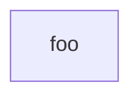

# ase_backend

## Technology choices

### Project management

### Frontend

* AngularJS
* Protractor (E2e testing)

### Backend

* Java
* Spring-Framework
* JUnit

### Software technology tools

* Pre-commit
* Sonarqube (?)

## Application

Games database / information page to find or recommend games of interest.

### Database of games

Some Classification (Tags, Genres, Groups)

### User and group management

Membership (Tags, Genres, Groups)

